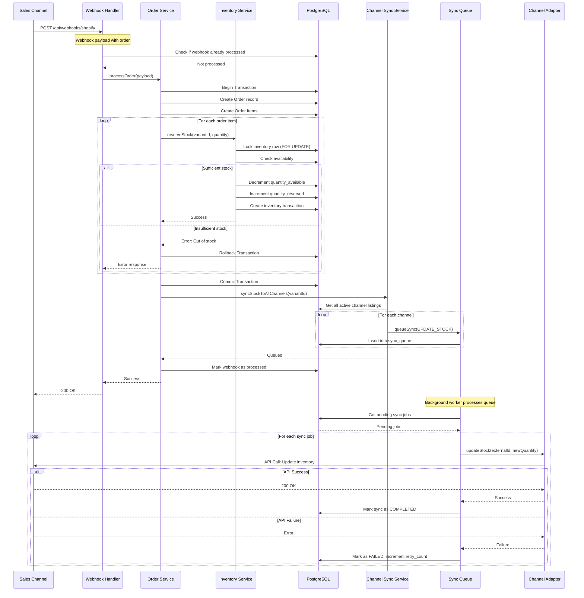
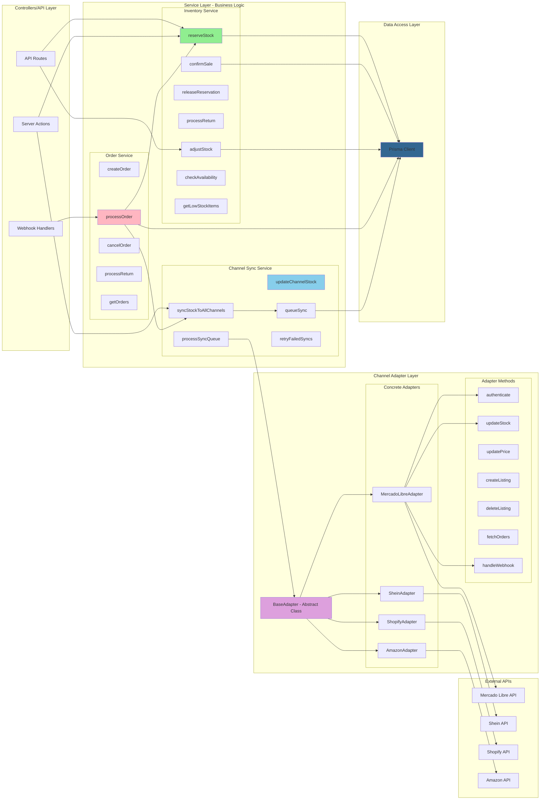
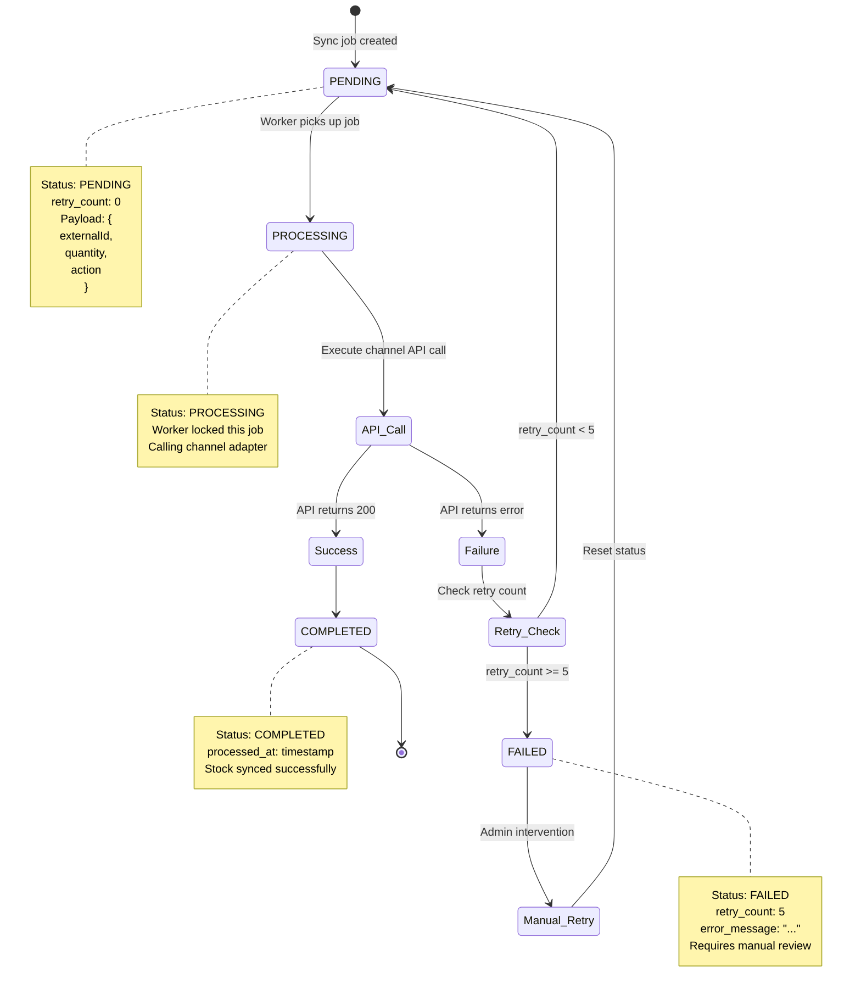
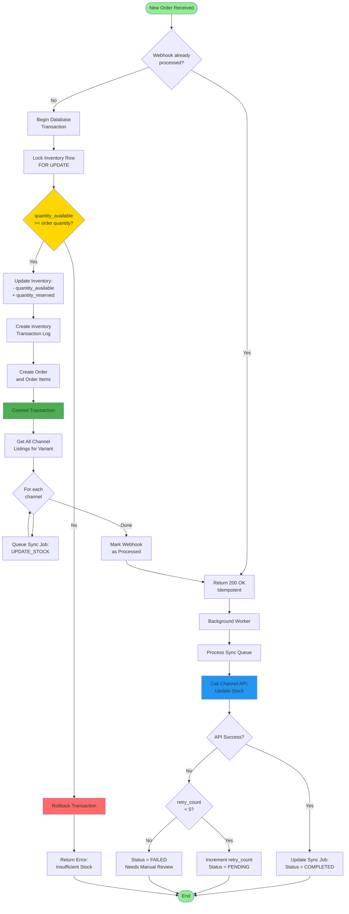

# Multi-Channel Shoe Inventory System - Architecture Diagrams

## 1. High-Level System Architecture

```mermaid
graph TB
    subgraph "External Channels"
        ML[Mercado Libre]
        SH[Shein]
        SP[Shopify]
        AZ[Amazon]
    end
    
    subgraph "Next.js Application"
        subgraph "Frontend Layer"
            UI[React UI Components]
            Pages[Next.js Pages/Routes]
        end
        
        subgraph "API Layer"
            API[API Routes]
            SA[Server Actions]
            WH[Webhook Handlers]
        end
        
        subgraph "Business Logic Layer"
            IS[Inventory Service]
            CS[Channel Sync Service]
            OS[Order Service]
        end
        
        subgraph "Integration Layer"
            BA[Base Adapter]
            MLA[ML Adapter]
            SHA[Shein Adapter]
            SPA[Shopify Adapter]
            AZA[Amazon Adapter]
        end
    end
    
    subgraph "Data Layer"
        PrismaClient[Prisma Client]
        PostgreSQL[(PostgreSQL Database)]
    end
    
    subgraph "Background Jobs"
        Queue[Sync Queue Processor]
        Worker[Background Worker]
    end
    
    subgraph "Cache Layer - Optional"
        Redis[(Redis Cache)]
    end
    
    %% External channel connections
    ML -->|Webhooks| WH
    SH -->|Webhooks| WH
    SP -->|Webhooks| WH
    AZ -->|Webhooks| WH
    
    MLA -->|API Calls| ML
    SHA -->|API Calls| SH
    SPA -->|API Calls| SP
    AZA -->|API Calls| AZ
    
    %% Frontend to API
    UI --> Pages
    Pages --> API
    Pages --> SA
    
    %% API to Services
    API --> IS
    API --> CS
    API --> OS
    SA --> IS
    SA --> CS
    SA --> OS
    WH --> OS
    
    %% Services to Integrations
    CS --> BA
    BA --> MLA
    BA --> SHA
    BA --> SPA
    BA --> AZA
    
    %% Services to Database
    IS --> PrismaClient
    CS --> PrismaClient
    OS --> PrismaClient
    PrismaClient --> PostgreSQL
    
    %% Background Processing
    CS --> Queue
    Queue --> Worker
    Worker --> BA
    Worker --> PrismaClient
    
    %% Cache
    IS -.->|Optional| Redis
    CS -.->|Optional| Redis
    
    style UI fill:#61dafb
    style Pages fill:#61dafb
    style PostgreSQL fill:#336791
    style Redis fill:#dc382d
    style ML fill:#fff159
    style SH fill:#000
    style SP fill:#96bf48
    style AZ fill:#ff9900
```



## 2. Database Entity Relationship Diagram

```mermaid
erDiagram
    PRODUCT ||--o{ PRODUCT_VARIANT : has
    PRODUCT_VARIANT ||--|| INVENTORY : tracks
    PRODUCT_VARIANT ||--o{ CHANNEL_LISTING : "listed on"
    PRODUCT_VARIANT ||--o{ ORDER_ITEM : "ordered as"
    PRODUCT_VARIANT ||--o{ INVENTORY_TRANSACTION : "has history"
    
    SALES_CHANNEL ||--o{ CHANNEL_LISTING : contains
    SALES_CHANNEL ||--o{ ORDER : receives
    SALES_CHANNEL ||--o{ SYNC_QUEUE : "queues for"
    
    ORDER ||--o{ ORDER_ITEM : contains
    
    PRODUCT {
        uuid id PK
        string model_name
        text description
        decimal base_price
        string image_url
        boolean is_active
        timestamp created_at
        timestamp updated_at
    }
    
    PRODUCT_VARIANT {
        uuid id PK
        uuid product_id FK
        string size
        string color
        string sku UK "model-size-color"
        string barcode UK
        timestamp created_at
        timestamp updated_at
    }
    
    INVENTORY {
        uuid id PK
        uuid variant_id FK-UK
        int quantity_available
        int quantity_reserved
        int quantity_sold
        int min_stock_threshold
        string warehouse_location
        timestamp last_restocked_at
        timestamp updated_at
    }
    
    SALES_CHANNEL {
        uuid id PK
        string name UK "mercadolibre"
        string display_name
        boolean is_active
        jsonb api_credentials "encrypted"
        jsonb config
        timestamp last_synced_at
        timestamp created_at
        timestamp updated_at
    }
    
    CHANNEL_LISTING {
        uuid id PK
        uuid variant_id FK
        uuid channel_id FK
        string external_id "channel's product id"
        string channel_sku
        decimal price
        boolean is_active
        timestamp last_synced_at
        timestamp created_at
        timestamp updated_at
    }
    
    ORDER {
        uuid id PK
        uuid channel_id FK
        string external_order_id
        enum status "PENDING|CONFIRMED|SHIPPED|etc"
        decimal total_amount
        jsonb customer_info
        text notes
        timestamp created_at
        timestamp updated_at
    }
    
    ORDER_ITEM {
        uuid id PK
        uuid order_id FK
        uuid variant_id FK
        int quantity
        decimal unit_price
        decimal subtotal
    }
    
    INVENTORY_TRANSACTION {
        uuid id PK
        uuid variant_id FK
        enum transaction_type "SALE|RETURN|ADJUSTMENT|RESTOCK"
        int quantity_change "positive or negative"
        string reference_type "order|manual|return"
        uuid reference_id
        text notes
        uuid created_by "user_id"
        timestamp created_at
    }
    
    SYNC_QUEUE {
        uuid id PK
        uuid variant_id FK
        uuid channel_id FK
        enum action "UPDATE_STOCK|UPDATE_PRICE|etc"
        jsonb payload
        enum status "PENDING|PROCESSING|COMPLETED|FAILED"
        int retry_count
        text error_message
        timestamp created_at
        timestamp updated_at
        timestamp processed_at
    }
```

## 3. Data Flow: Order Processing



## 4. Component Architecture: Frontend

```mermaid
graph TB
    subgraph "Next.js App Router Structure"
        Root[app/layout.tsx]
        
        subgraph "Dashboard Routes - (dashboard)"
            DashLayout[layout.tsx - Dashboard Layout]
            DashPage[page.tsx - Dashboard Home]
            
            subgraph "Inventory Section"
                InvPage[inventory/page.tsx]
                InvDetail[inventory/[id]/page.tsx]
            end
            
            subgraph "Products Section"
                ProdList[products/page.tsx]
                ProdNew[products/new/page.tsx]
                ProdDetail[products/[id]/page.tsx]
                ProdEdit[products/[id]/edit/page.tsx]
            end
            
            subgraph "Channels Section"
                ChanList[channels/page.tsx]
                ChanDetail[channels/[id]/page.tsx]
            end
            
            subgraph "Orders Section"
                OrderList[orders/page.tsx]
                OrderDetail[orders/[id]/page.tsx]
            end
            
            subgraph "Analytics Section"
                Analytics[analytics/page.tsx]
            end
        end
        
        subgraph "API Routes"
            ProductAPI[api/products/route.ts]
            InventoryAPI[api/inventory/route.ts]
            OrderAPI[api/orders/route.ts]
            ChannelAPI[api/channels/route.ts]
            WebhookAPI[api/webhooks/[channel]/route.ts]
            SyncAPI[api/sync/route.ts]
        end
    end
    
    subgraph "Reusable Components"
        subgraph "UI Components - shadcn/ui"
            Button[Button]
            Table[Table]
            Form[Form]
            Dialog[Dialog]
            Card[Card]
            Badge[Badge]
        end
        
        subgraph "Inventory Components"
            InvTable[InventoryTable]
            StockModal[StockAdjustmentModal]
            LowStockAlert[LowStockAlert]
        end
        
        subgraph "Product Components"
            ProductForm[ProductForm]
            VariantManager[VariantManager]
            ProductCard[ProductCard]
        end
        
        subgraph "Channel Components"
            ChannelCard[ChannelCard]
            ChannelConfig[ChannelConfigForm]
            SyncStatus[SyncStatus]
        end
        
        subgraph "Order Components"
            OrderListComp[OrderList]
            OrderDetails[OrderDetails]
        end
        
        subgraph "Analytics Components"
            SalesChart[SalesChart]
            StatsCard[StatsCard]
        end
    end
    
    subgraph "Server Actions"
        ProductActions[product-actions.ts]
        InventoryActions[inventory-actions.ts]
        OrderActions[order-actions.ts]
        ChannelActions[channel-actions.ts]
    end
    
    Root --> DashLayout
    DashLayout --> DashPage
    DashLayout --> InvPage
    DashLayout --> ProdList
    DashLayout --> ChanList
    DashLayout --> OrderList
    DashLayout --> Analytics
    
    InvPage --> InvTable
    InvTable --> StockModal
    DashPage --> LowStockAlert
    
    ProdList --> ProductCard
    ProdNew --> ProductForm
    ProductForm --> VariantManager
    
    ChanList --> ChannelCard
    ChanDetail --> ChannelConfig
    ChannelCard --> SyncStatus
    
    OrderList --> OrderListComp
    OrderDetail --> OrderDetails
    
    Analytics --> SalesChart
    Analytics --> StatsCard
    
    InvTable --> Button
    InvTable --> Table
    StockModal --> Dialog
    ProductForm --> Form
    
    InvPage --> InventoryActions
    ProdNew --> ProductActions
    OrderList --> OrderActions
    ChanList --> ChannelActions
    
    style Root fill:#0070f3
    style DashLayout fill:#0070f3
    style Button fill:#61dafb
    style Table fill:#61dafb
    style Form fill:#61dafb
```

## 5. Service Layer Architecture



## 6. Sync Queue Processing Flow



## 7. Stock Management Flow



## 8. File Structure Overview

```mermaid
graph TB
    subgraph "Root Directory"
        Root[shoe-inventory/]
    end
    
    subgraph "Source Code - src/"
        App[app/]
        Components[components/]
        Lib[lib/]
        Actions[actions/]
        Services[services/]
        Types[types/]
    end
    
    subgraph "Database - prisma/"
        Schema[schema.prisma]
        Migrations[migrations/]
        Seed[seed.ts]
    end
    
    subgraph "Configuration Files"
        Package[package.json]
        TSConfig[tsconfig.json]
        TailwindConfig[tailwind.config.ts]
        NextConfig[next.config.js]
        EnvExample[.env.example]
        Docker[docker-compose.yml]
    end
    
    Root --> App
    Root --> Components
    Root --> Lib
    Root --> Actions
    Root --> Services
    Root --> Types
    Root --> Schema
    Root --> Migrations
    Root --> Seed
    Root --> Package
    Root --> TSConfig
    Root --> TailwindConfig
    Root --> NextConfig
    Root --> EnvExample
    Root --> Docker
    
    App --> AppRoutes[Routes & Pages]
    App --> APIRoutes[API Routes]
    
    Components --> UIComps[UI Components<br/>shadcn/ui]
    Components --> FeatureComps[Feature Components<br/>Inventory, Products, etc.]
    
    Lib --> PrismaClient[prisma.ts]
    Lib --> Validations[validations.ts]
    Lib --> ChannelAdapters[channels/]
    
    Actions --> ProductAct[product-actions.ts]
    Actions --> InventoryAct[inventory-actions.ts]
    Actions --> OrderAct[order-actions.ts]
    
    Services --> InvService[inventory-service.ts]
    Services --> SyncService[channel-sync-service.ts]
    Services --> OrderService[order-service.ts]
    
    style Root fill:#0070f3
    style Schema fill:#2D3748
    style PrismaClient fill:#2D3748
    style InvService fill:#48BB78
    style SyncService fill:#4299E1
```



## 9. Technology Stack Layers

```mermaid
graph TB
    subgraph "Presentation Layer"
        Browser[Web Browser]
        React[React 18+]
        NextJS[Next.js 14 App Router]
        Tailwind[Tailwind CSS]
        ShadcnUI[shadcn/ui Components]
    end
    
    subgraph "Application Layer"
        ServerActions[Server Actions]
        APIRoutes[API Routes]
        ReactQuery[TanStack Query]
    end
    
    subgraph "Business Logic Layer"
        Services[Service Classes]
        Validations[Zod Validations]
    end
    
    subgraph "Data Access Layer"
        PrismaClient[Prisma Client]
        PrismaSchema[Prisma Schema]
    end
    
    subgraph "Database Layer"
        PostgreSQL[(PostgreSQL 15)]
    end
    
    subgraph "Integration Layer"
        Adapters[Channel Adapters]
        ExternalAPIs[External Channel APIs]
    end
    
    subgraph "Infrastructure"
        Docker[Docker Containers]
        NextjsServer[Next.js Server]
        NodeRuntime[Node.js Runtime]
    end
    
    Browser --> React
    React --> NextJS
    NextJS --> Tailwind
    NextJS --> ShadcnUI
    
    NextJS --> ServerActions
    NextJS --> APIRoutes
    React --> ReactQuery
    ReactQuery --> APIRoutes
    
    ServerActions --> Services
    APIRoutes --> Services
    Services --> Validations
    
    Services --> PrismaClient
    PrismaClient --> PrismaSchema
    PrismaSchema --> PostgreSQL
    
    Services --> Adapters
    Adapters --> ExternalAPIs
    
    NextjsServer --> NodeRuntime
    PostgreSQL --> Docker
    
    style Browser fill:#61dafb
    style NextJS fill:#000000
    style PrismaClient fill:#2D3748
    style PostgreSQL fill:#336791
    style Docker fill:#2496ED
```



## 10. Deployment Architecture (Production Ready)

```mermaid
graph TB
    subgraph "Client Side"
        Users[Users]
    end
    
    subgraph "Vercel Platform"
        NextApp[Next.js Application<br/>Edge Network]
        ServerFunctions[Serverless Functions<br/>API Routes + Server Actions]
    end
    
    subgraph "Database - Hosted"
        PostgresManaged[(Managed PostgreSQL<br/>Supabase/Neon/Railway)]
    end
    
    subgraph "Cache - Optional"
        RedisManaged[(Managed Redis<br/>Upstash/Railway)]
    end
    
    subgraph "Background Jobs"
        CronJobs[Vercel Cron Jobs<br/>or separate worker]
    end
    
    subgraph "External Services"
        ML_Service[Mercado Libre API]
        Shopify_Service[Shopify API]
        Amazon_Service[Amazon API]
        Shein_Service[Shein API]
    end
    
    subgraph "Monitoring & Logging"
        Sentry[Sentry<br/>Error Tracking]
        Analytics[Vercel Analytics]
    end
    
    Users -->|HTTPS| NextApp
    NextApp --> ServerFunctions
    
    ServerFunctions --> PostgresManaged
    ServerFunctions -.->|Optional| RedisManaged
    
    ServerFunctions --> ML_Service
    ServerFunctions --> Shopify_Service
    ServerFunctions --> Amazon_Service
    ServerFunctions --> Shein_Service
    
    ML_Service -->|Webhooks| ServerFunctions
    Shopify_Service -->|Webhooks| ServerFunctions
    Amazon_Service -->|Webhooks| ServerFunctions
    Shein_Service -->|Webhooks| ServerFunctions
    
    CronJobs -->|Process Queue| ServerFunctions
    CronJobs -->|Retry Failed Syncs| ServerFunctions
    
    NextApp --> Sentry
    NextApp --> Analytics
    ServerFunctions --> Sentry
    
    style Users fill:#61dafb
    style NextApp fill:#000000
    style PostgresManaged fill:#336791
    style RedisManaged fill:#dc382d
    style Sentry fill:#362d59
```



---

## Summary

These diagrams cover:

1. **High-Level System Architecture** - Overall system components and their interactions
2. **Database ERD** - All tables, relationships, and key fields
3. **Order Processing Flow** - Sequence diagram showing how orders are processed
4. **Frontend Component Architecture** - Next.js App Router structure
5. **Service Layer Architecture** - Business logic organization
6. **Sync Queue Processing** - State machine for background job processing
7. **Stock Management Flow** - Detailed flowchart of inventory updates
8. **File Structure** - Project organization
9. **Technology Stack Layers** - Tech stack from frontend to database
10. **Production Deployment** - Cloud deployment architecture

Each diagram provides a different perspective on the system, helping you understand:
- How data flows through the application
- How components are organized
- How services interact
- How the database is structured
- How background jobs work
- How to deploy to production

You can use these diagrams as reference while developing or share them with team members to explain the architecture!
